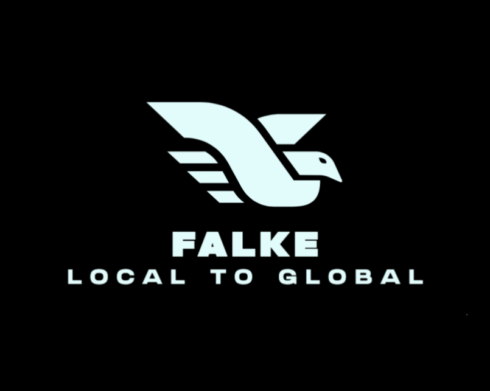

# Falke

A reverse proxy tool that lets you easily expose your local web server to the public internet.

# Usage

Let’s say your web service is running locally on localhost:8080.

### For Windows or macOS (using Docker Desktop)

```shell
docker run -it --rm ghcr.io/xianyuntang/falke cli http host.docker.internal:8080
```

### For Ubuntu

```shell
docker run -it --netwokr host --rm ghcr.io/xianyuntang/falke cli http localhost:8080
```

You can also specify a custom subdomain by adding the --subdomain flag to the command

```shell
... --subdomain <your custom subdomain>
```

TODO

- [ ] housekeeper
- [ ] grpc
- [ ] unit test

